# CAPSTONE PROJECT: E-commerce Platform Deployment with Git, Linux and AWS

## Implement Version Control With Git -
The following were achieved:
1. Initialize Git Repository
2. Obtain and Prepare the E-Commerce Website Template
3. Stage and Commit the Template to Git
4. Push the code to your Github repository

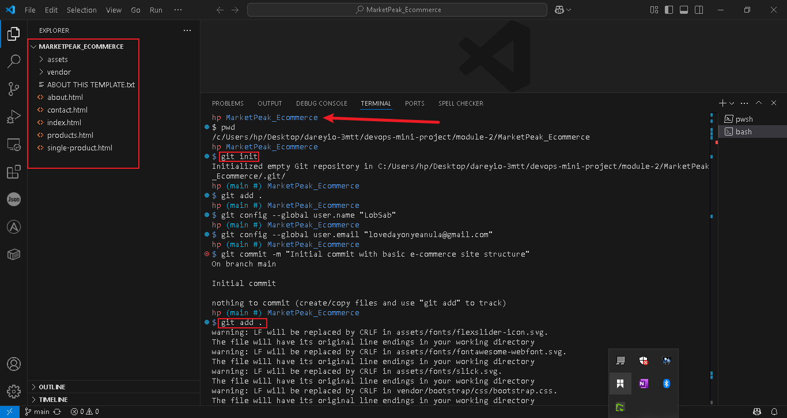

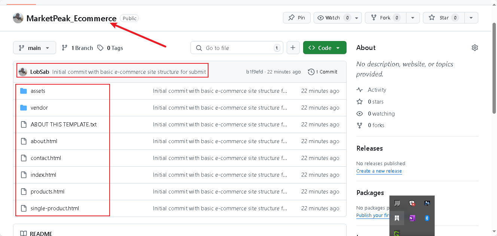

## AWS Deployment
In the AWS deployment the following was setup:
1. Create an AWS EC2 instance
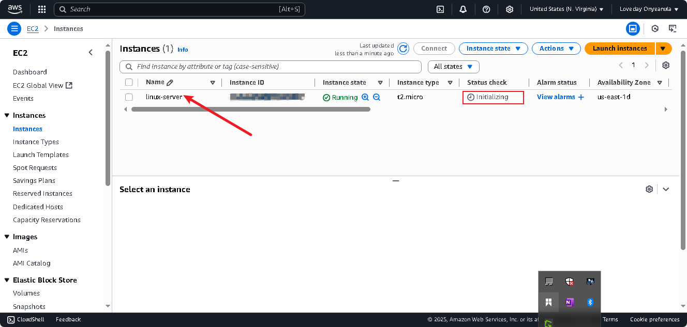

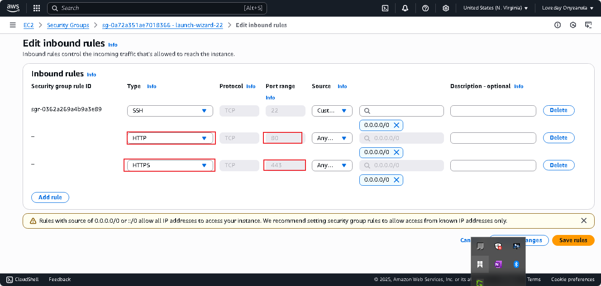

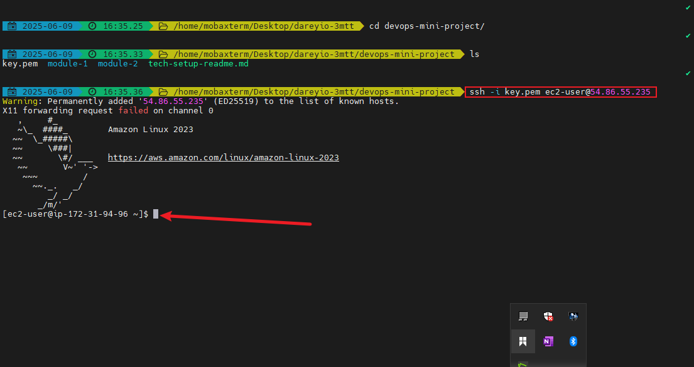

2. Clone the Repository on the Linux Server

3. Initiated and ssh keygen for GitHub aunthentication

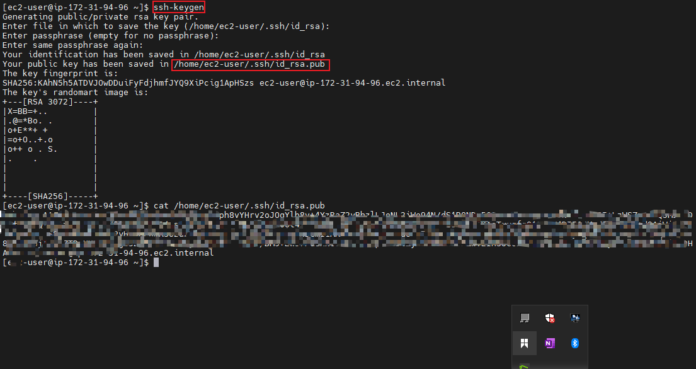

4. Configure httpd for Website
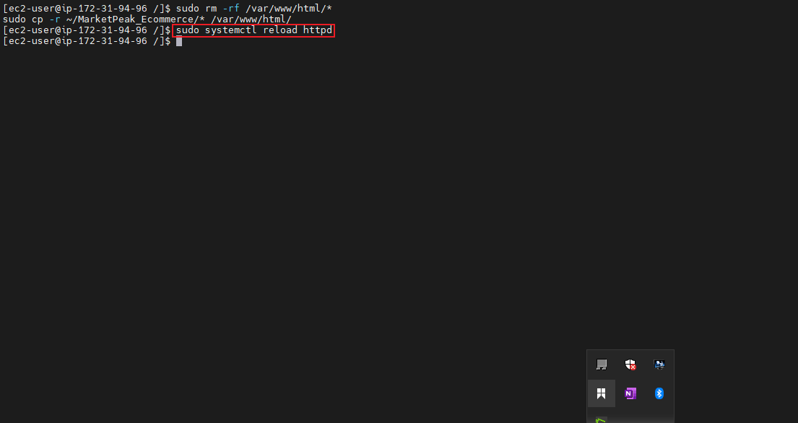

5. Access Website from Browser
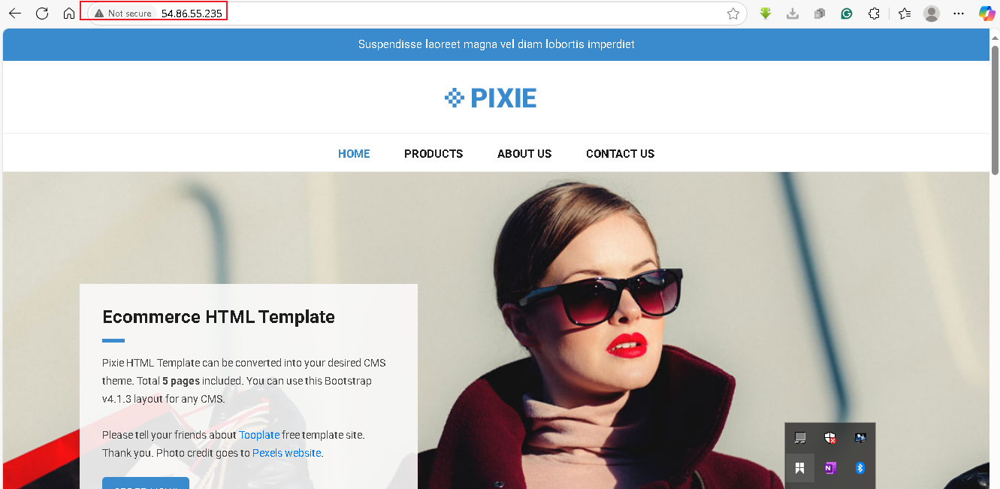

## Continuous Integration and Deployment Workflow
1. Create a Development Branch
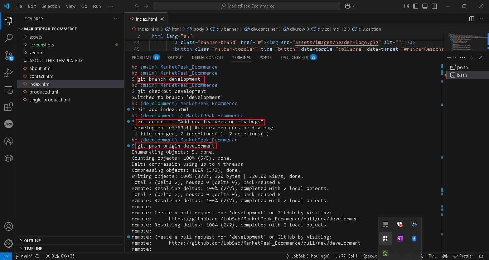

2. Developing new features and fixes

3. Initiate Git Pull Request and Merge to the main branch
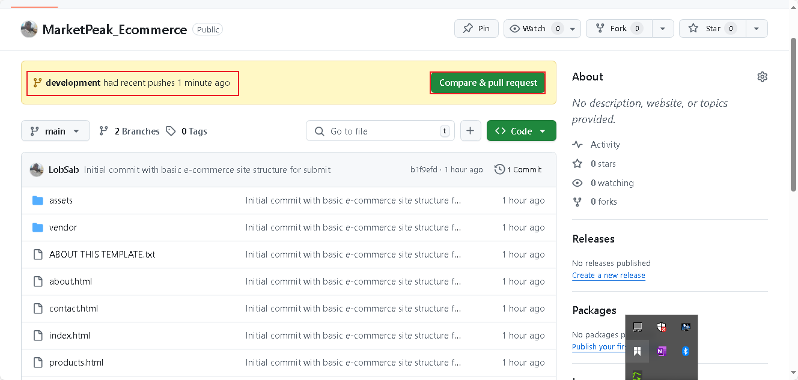

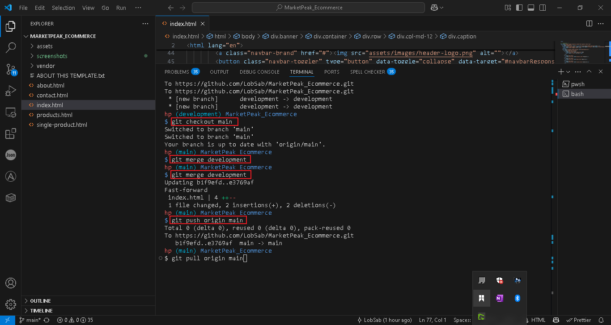

4. Initiate git pull and reload the webserver
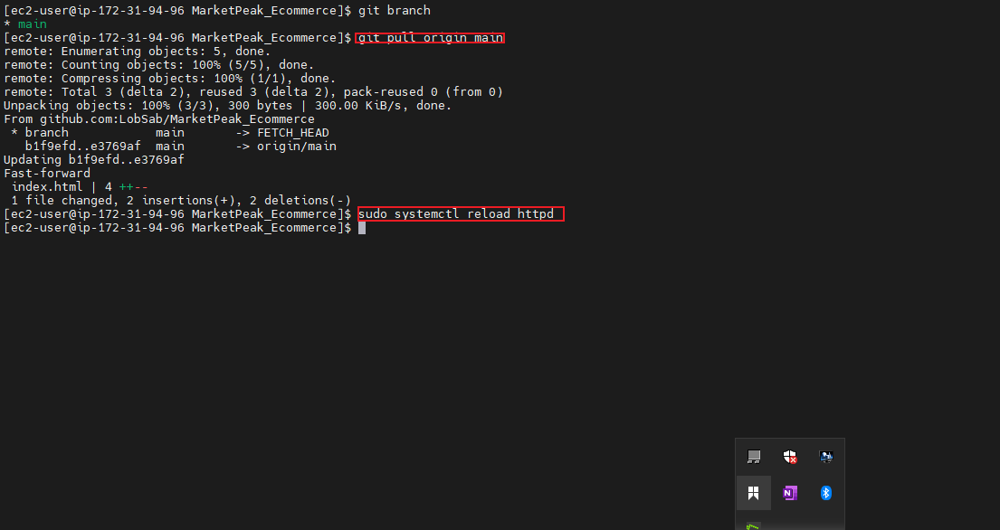